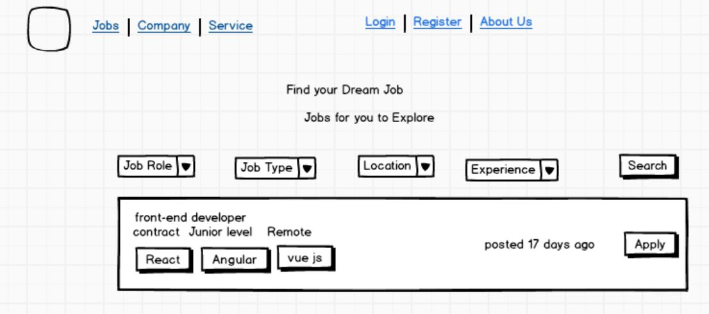
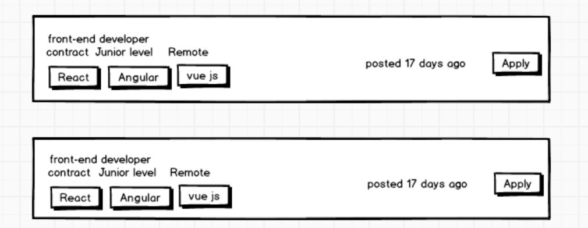
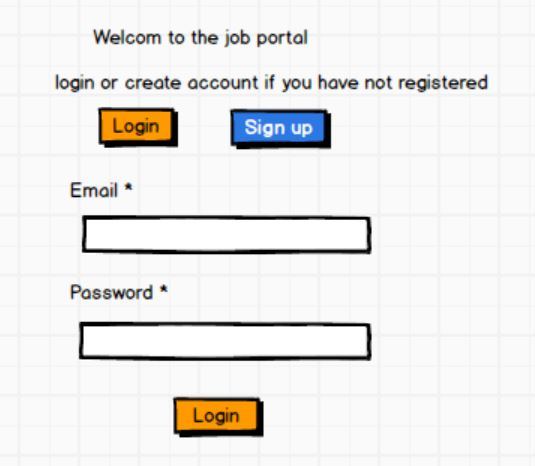

# MVP-for-the-job-portal-app

### progress
### On a scale of 1 to 10, how would you rate the progress you’ve made this week?

I give myself an 8. In addition to finishing the Firebase authentication, I'm working on the static web application for the job posting portal.

### What parts of your project are completed as planned?
The authentication process is complete, but I'm still reading through Redux to learn how to use the reducer, action, and data storage features.
### What aspects of your project are incomplete?
- the related companies and 
- the service the company or the job portal provides.

# challenges
### Explain the most difficult technical challenge you encountered in this second week.

I encountered quering data the data to the web page  error. Although it is not displayed on the web application, the data from the child component is passed to the parent component. The data is picked and provided to the parent component as props, according to the console check I did. The issue persists and I am unable to resolve it.

The challenges I am facing are:

 *UI Complexity*: Squeezing all the functionalities (search, account management, application) into a single user interface can be tricky. This highlights a challenge I likely didn't anticipate during initial research.

 *Learning Redux*: Having to learn Redux quickly indicates a knowledge gap I didn't expect.

### Describe the most difficult non-technical challenge you encountered in this second week,

*Time Management*: Struggling with time management is common, but it becomes more significant when working on an MVP with a tight 
 deadline.

# status of my project 

